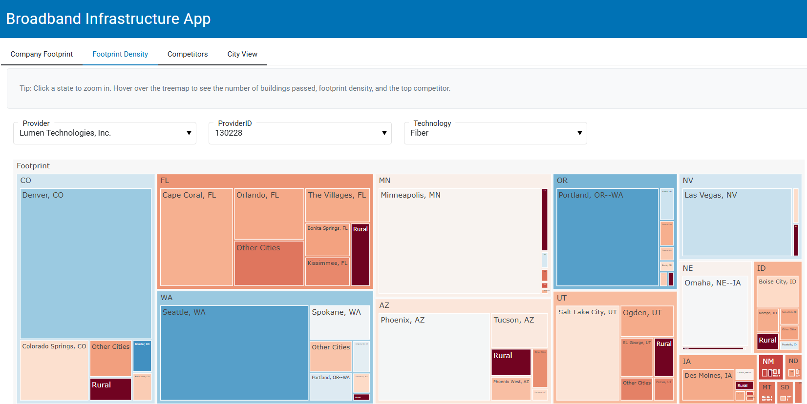

# Deal Team Tools

## [Value Creation Strategy in Underwriting](value-creation-underwriting/)

Investors can design cost-effective market-entry strategies with **digital-twin precision — anywhere in the world**.

For example, this model maps a set of satellite-identified buildings against mobile coverage, tower visibility, and fiber node proximity to generate the lowest-cost connectivity path. The model doesn’t just highlight where to go — it shows exactly how to get there, asset by asset, based on local infrastructure realities.

A digital twin is a Monopoly board with real assets and precise cost estimates: every building, every fiber route, every signal layer quantified. The strategy is geospatially grounded, commercially prioritized, and ready to deploy where it delivers the most value.

[Learn more →](value-creation-underwriting/)

## [Dashboards for Rapid Assessment of Targets](dashboards/)

In a fragmented sector, distilling building-level data into actionable insights with high-tech tools can enable **faster screening or a swift validation of claims** — without waiting on a full diligence cycle.

With thousands of fiber operators in the US, investors can quickly leverage a dashboard when a CIM arrives or when developing investment ideas. For example, the tool can surface the density of the company's footprint, as a proxy for cost competitiveness, or the speed of its broadband product offerings, as a proxy for pricing power.

[Learn more →](dashboards/)
