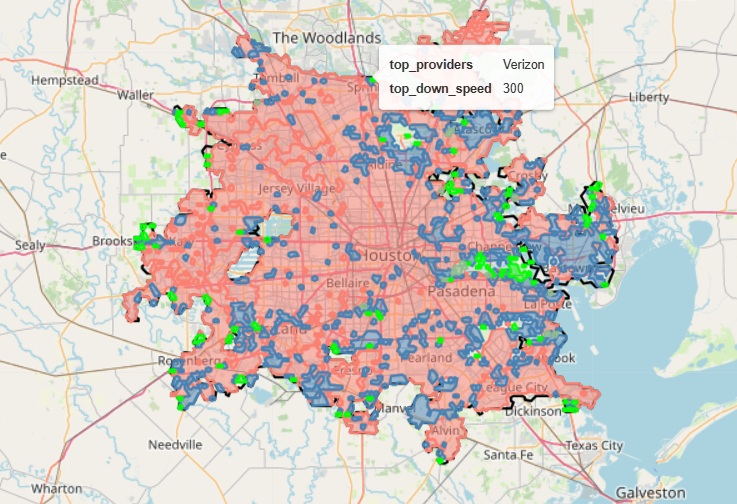
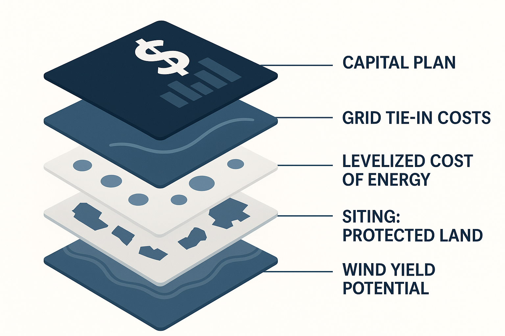

# Post-Acquisition Tools

## [Portfolio Value Creation](portfolio)

To assess attractive markets for fiber expansion or copper upgrades, investors used to focus on traditional mapping of fiber-versus-fiber competition. But the data revealed a shift: **fixed wireless**, long dismissed as too slow, is emerging as a high-capacity rival powered by 5G. In parallel, **cable operators** — once seen as mid-speed players — are rolling out gigabit offerings that challenge fiber’s dominance. This updated view of competitive dynamics uncovered areas where fiber still has a clear edge, shaping a more targeted and forward-looking value creation plan.

[Learn more →](portfolio)

## [Synergies from Co-Locating Clean Power](synergies)

Investors are zeroing in on a key question: where **clean energy can be deployed most cost-effectively to power data centers**, ideally through co-location.

There’s a growing opportunity to apply advanced geospatial models that identify optimal sites for wind and solar development, factoring in land use, transmission proximity, and long-run generation economics. For data center investors, this means sharper site selection and power strategy: locating assets where clean energy is cheapest, scalable, and most reliable.

These geospatial tools **translate renewable potential into clear investment recommendations**, aligning sustainability goals with margin expansion.

[Learn more →](synergies)
